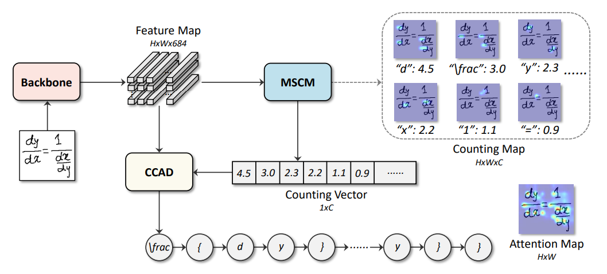

# When Counting Meets HMER: Counting-Aware Network for Handwritten Mathematical Expression Recognition

## 目录

- [1. 简介]()

- [2. 数据集和复现精度]()

- [3. 准备数据与环境]()
    - [3.1 准备环境]()
    - [3.2 准备数据]()
    - [3.3 准备模型]()
    
- [4. 开始使用]()
    - [4.1 模型训练]()
    - [4.2 模型评估]()
    - [4.3 模型预测]()
    
- [5. 模型推理部署]()
    - [5.1 基于Inference的推理]()
    - [5.2 基于Serving的服务化部署]()
    
- [6. 自动化测试脚本]()

- [7. LICENSE]()

- [8. 参考链接与文献]()

    

## 1. 简介

Counting-Aware Network（CAN）是2022年ECCV会议收录的手写数学公式识别新算法，其主要创新点如下：

- 设计了多尺度计数模块（Multi-Scale Counting Module，MSCM）计数每一个符号的出现次数，从而提升检测的准确率；
- 设计了结合计数的注意力解码器：使用位置编码表征特征图中不同空间位置，加强模型对于空间位置的感知。



**论文:** [When Counting Meets HMER: Counting-Aware Network for Handwritten Mathematical Expression Recognition](https://arxiv.org/abs/2207.11463)

**参考repo:** [https://github.com/LBH1024/CAN](https://github.com/LBH1024/CAN)

在此非常感谢`$参考repo的 github id$`等人贡献的[repo name](url)，提高了本repo复现论文的效率。

**aistudio体验教程:** [地址](url)


**目录说明**
```
--CAN
	--alignment                  # 对齐相关代码，删除后为完整复现代码
        --step1-5
            --data               # 存放假数据（fake_data)和网络权重
            --lite_data          # 轻量数据集（16张，用于数据读取对齐）
            --can_paddle         # paddle 复现代码
            --can_ref            # torch 实现参考代码
            01_test_forward.py   # 前向对齐主函数
            02_test_data.py      # 数据读取对齐主函数
            03_test_metric.py    # 评估指标对齐主函数
            04_test_loss.py      # 损失函数对齐主函数
            05_test_backward.py  # 反向对齐主函数
            config.yaml          # 用于对齐的配置文件，包含路径等信息
            torch2paddle.py      # 权重转换函数（torch权重转换为paddle）
            utilities.py         # 常用方法
        --result                 # 对齐结果
	--images
    --logs
    --models                     # 模型定义
    --paddlevision               # 数据集加载等相关工具函数
	--scripts
        --train.sh
        --eval.sh
        --infer.sh
        --export.sh
	--test_images
	  --lite_data.tar
	--test_tipc
    --tools
        --train.py
        --eval.py
        --infer.py
        --export.py
    --utils 
```

## 2. 数据集和复现精度

本repo使用的数据集为 CROHME，内容为手写公式图片和对应的识别序列。

格式如下：

- 数据集大小：CROHME共包含8884个样本(其中训练样本8835），识别序列由111类符号组成。
- 数据集下载链接：[前往百度网盘直接下载](https://pan.baidu.com/share/init?surl=qUVQLZh5aPT6d7-m6il6Rg)（提取码1234）
- 数据格式：图像数据存在pkl文件中，符号序列存在txt文本中，请根据对应文件读取方法进行读取。

| 模型      | 参考精度 | 复现精度 | 下载链接 |
|:---------:|:------:|:----------:|:----------:|
| CAN | - | -   | [预训练模型](https://paddle-model-ecology.bj.bcebos.com/model/alexnet_reprod/alexnet_pretrained.pdparams) \|  [Inference模型](https://paddle-model-ecology.bj.bcebos.com/model/alexnet_reprod/alexnet_infer.tar) \| [日志](https://paddle-model-ecology.bj.bcebos.com/model/alexnet_reprod/alexnet_train.log) |

## 3. 准备数据与环境


### 3.1 准备环境

* 下载代码

```bash
git clone https://github.com/Lllllolita/CAN_Paddle.git
cd CAN_paddle
```

* 安装paddlepaddle

```bash
# 需要安装2.2及以上版本的Paddle
# 安装GPU版本的Paddle
pip install paddlepaddle-gpu==2.3.2
# 安装CPU版本的Paddle
pip install paddlepaddle==2.3.2
```

更多安装方法可以参考：[Paddle安装指南](https://www.paddlepaddle.org.cn/)。

* 安装requirements

```bash
pip install -r requirements.txt
```

### 3.2 准备数据

您可以在[百度网盘](https://pan.baidu.com/share/init?surl=qUVQLZh5aPT6d7-m6il6Rg)下载全量数据集。下载数据集后，将CROHME文件夹放置于paddlevision/datasets文件夹中。

如果只是希望快速体验模型训练功能，则可以直接解压`test_images/lite_data.tar`，其中包含16张训练图像以及16张验证图像。

```
tar -xf test_images/lite_data.tar
```


### 3.3 准备模型

预训练模型：您可以在[百度网盘](https://pan.baidu.com/s/1bWG8UNK_GA9UxXkZ4RD7XA)下载预训练模型，提取码：n5ea。<br>下载模型文件后，将config.yaml中的checkpoint改为模型文件的前缀名。<br>
inference模型：[前往百度网盘直接下载](https://pan.baidu.com/s/1Jjfw7cSz9NRbGmINO2k1wg)(提取码：ipz9)

## 4. 开始使用


### 4.1 模型训练

训练文件在tools文件夹的train.py，由于代码中的路径均使用与CAN文件夹的相对路径形式表示，因此需要先将CAN文件夹指定为python的环境变量，设置为搜索路径的根路径。
进入CAN文件夹，假设文件夹的绝对路径为/home/a/CAN
```
export PYTHONPATH=$PYTHONPATH:/home/a/CAN
```
然后启动训练命令
```
python tools/train.py --dataset CROHME
```
若训练启动成功，则会输出日志
```
Loading data
共 111 类符号。
训练数据路径 images: paddlevision/datasets/CROHME/train_images.pkl labels: paddlevision/datasets/CROHME/train_labels.txt
验证数据路径 images: paddlevision/datasets/CROHME/14_test_images.pkl labels: paddlevision/datasets/CROHME/14_test_labels.txt
train dataset: 8835 train steps: 1105 eval dataset: 986 eval steps: 986 
Creating model
CAN_2022-09-21-11-48_decoder-AttDecoder
init tensorboard
Start training
[Epoch 1, iter: 1] wordRate: 0.10467, expRate: 0.00000, lr: 0.00001, loss: 905.89594, avg_reader_cost: 0.17917 sec, avg_batch_cost: 2.57803 sec, avg_samples: 8.0, avg_ips: 3.10314 images/sec.
[Epoch 1, iter: 2] wordRate: 0.05784, expRate: 0.00000, lr: 0.00002, loss: 1293.39844, avg_reader_cost: 0.00120 sec, avg_batch_cost: 0.69045 sec, avg_samples: 8.0, avg_ips: 11.58666 images/sec.
[Epoch 1, iter: 3] wordRate: 0.04320, expRate: 0.00000, lr: 0.00003, loss: 500.51590, avg_reader_cost: 0.00118 sec, avg_batch_cost: 0.85754 sec, avg_samples: 8.0, avg_ips: 9.32896 images/sec.
```
超参数设置于config.yaml，包括初始学习率、批大小等。

### 4.2 模型评估

简单说明一下评估的命令以及结果，建议附一些简短的评估日志。

评估文件在tools文件夹的train.py，由于代码中的路径均使用与CAN文件夹的相对路径形式表示，因此需要先将CAN文件夹指定为python的环境变量，设置为搜索路径的根路径。
进入CAN文件夹，假设文件夹的绝对路径为/home/a/CAN
```
export PYTHONPATH=$PYTHONPATH:/home/a/CAN
```
然后启动评估命令
```
python tools/train.py --dataset CROHME --test-only
```
若评估启动成功，则会输出日志
```
Loading data
共 111 类符号。
训练数据路径 images: paddlevision/datasets/CROHME/train_images.pkl labels: paddlevision/datasets/CROHME/train_labels.txt
验证数据路径 images: paddlevision/datasets/CROHME/14_test_images.pkl labels: paddlevision/datasets/CROHME/14_test_labels.txt
train dataset: 8835 train steps: 1105 eval dataset: 986 eval steps: 986 
Creating model
CAN_2022-09-22-16-32_decoder-AttDecoder
init tensorboard
[Epoch 1, iter: 1] wordRate: 0.78571, expRate: 0.00000, word_loss: 0.73745, counting_loss: 0.06702
[Epoch 1, iter: 2] wordRate: 0.85185, expRate: 0.00000, word_loss: 0.31574, counting_loss: 0.01928
[Epoch 1, iter: 3] wordRate: 0.80723, expRate: 0.00000, word_loss: 1.06320, counting_loss: 0.32089
```

### 4.3 模型预测
预测预训练模型可以通过模型准备的百度网盘的连接进行下载，预测样例图片在test_images的test_expamples里，词表文件为test_images的word-dict.txt。

简单的预测命令如下：
```
python tools/predict.py --pretrained your_model_path --img_path your_img_path --config_file your_config_file --word_path your_word_path
```
其中,--pretrained写入预测所需模型文件夹路径，--img_path需要提供预测图片路径，--config_file需要提供配置文件路径,--word_path需要提供词表路径。如果出现infer_model无法引入的情况，可以将predict.py移出tools文件夹，将命令更改为：
```
python predict.py --pretrained your_model_path --img_path your_img_path --config_file your_config_file --word_path your_word_path
```
输出结果格式如下所示:
```
共 111 类符号。
seq_prob: \sum _ { n = 1 } ^ { \infty } \frac { \cos \pi n } { n }
```


## 5. 模型推理部署

模型使用inference进行推理部署，简单的推理命令如下：
```
python tools/infer.py --model_dir your_model_path --img_path your_img_path --word_path your_word_path
```
其中,--model_dir写入预测所需模型文件夹路径，--img_path需要提供预测图片路径，--word_path需要提供词表路径。
输出结果格式如下所示:
```
共 111 类符号。
image_name: ./images/RIT_2014_94.jpeg, result_seq: \sum _ { n = 1 } ^ { \infty } \frac { \cos \pi n } { n }
```


## 6. 自动化测试脚本

介绍下tipc的基本使用以及使用链接


## 7. LICENSE

本项目的发布受[Apache 2.0 license](./LICENSE)许可认证。

## 8. 参考链接与文献
