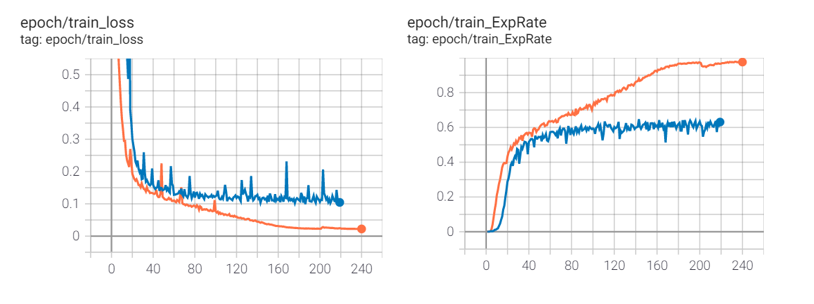
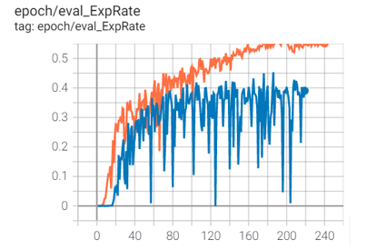
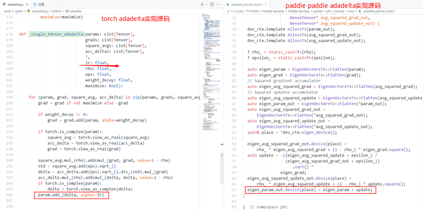
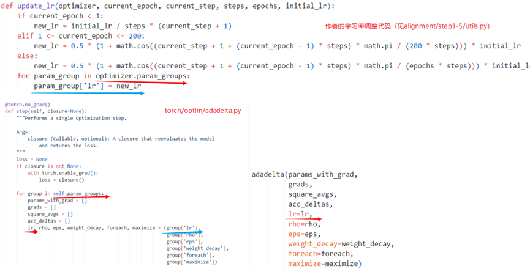
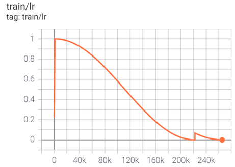
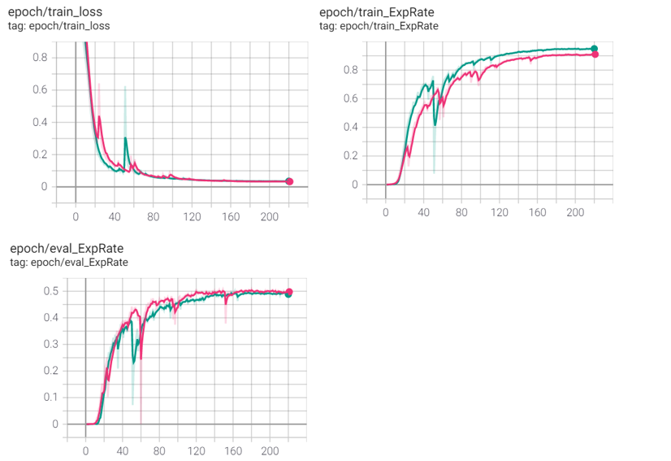

## 复现训练过程中的实验设置和分析

#### 1. 使用Adadelta优化器的实验参数和结果

​针对Adadelta优化器的实验，即原文作者使用的一系列参数如下表所示。

|      参数                | 值                                                           |
| -------------------- | ------------------------------------------------------------ |
| batch size           | 8                                                            |
| 卷积层、线性层初始化 | kaiming Uniform                                              |
| GRUCell初始化        | Uniform                                                      |
| 学习率               | 初始值为1，第一个epoch从0开始warmup，第二个epoch进行余弦退火调整，周期为200epoch，第201个epoch改变余弦周期为240（paddle使用LRScheduler） |
| 优化器参数           | eps=1e-6，rho=0.9，weightdecay=1e-4                          |
| 梯度裁剪             | Paddle.nn.ClipGradByGlobalNorm   Torch.nn.utils.clip_grad_norm_   梯度值为100 |

​我们使用原版torch代码训练240epoch后的指标exprate达到了56.29，但是使用paddlepaddle训练的结果并不理想。我们在图1给出了训练时的各项指标曲线对比。其中，橙色曲线为torch版本模型的训练、验证曲线，蓝色曲线为paddle版本模型的训练、验证曲线。

​观察上图可以看出，使用paddle的Adadelta优化器对模型进行优化，在100epoch左右，模型的学习遇到了瓶颈，loss不再下降，评估指标也不再上升，并且时常出现剧烈震荡。		

​为了验证是否为模型复现出现了问题，我们做了反复的对比实验，结果并没有太大差异。随后我们仔细检查了对齐中的每一步，并在paddlepaddle上提出了issue但是并没能有效解决这个问题。我们注意到官方文档表示adadelta优化器和torch版的实现不一致，所以去查看了paddlepaddle和pytorch对adadelta的实现源码，具体差异和分析见下一节。

#### 2. 关于torch和paddlepaddle关于Adadelta的实现差异

​		我们在[pytorch](https://github.com/pytorch/pytorch/blob/master/torch/optim/adadelta.py)和[paddle](https://github.com/PaddlePaddle/Paddle/blob/develop/paddle/phi/kernels/impl/adadelta_kernel_impl.h)官方仓库中找到了二者关于adadelta实现的代码，并发现有以下差异。

​上图红色标记部分的实现略有不同，差异在学习率lr，torch中将lr作为了迭代更新参数的系数，而paddle并没有对update值乘lr，该方法也没有接收lr值，我们也注意到论文中的算法没有乘学习率。

​但是由于本文作者使用了学习率调整方法（如图3所示），而torch实现的Adadelta又接收lr作为参数，因此即使它的初始值是1，在后续的过程中由于学习率调整，参数更新时delta（对应paddle中的update）的系数并非是常数。

我们在复现时使用LRScheduler实现了作者的学习率调整策略（见[paddlevision/optimizer/lr_scheduler.py](paddlevision/optimizer/lr_scheduler.py)），并用tensorboard输出了学习率结果（见图4），与torch版一致。

​                               

考虑到两个框架对 Adadelta 的实现不一致，我们使用SGD做了一组对比实验，具体数据和结果见第三节

#### 3. 使用SGD优化器的实验参数和结果

|       参数               | 值                                                           |
| -------------------- | ------------------------------------------------------------ |
| batch size           | 8                                                            |
| 卷积层、线性层初始化 | kaiming Uniform                                              |
| GRUCell初始化        | 权重正交初始化，偏置常数初始化为0                            |
| 学习率               | 初始值为1，第一个epoch从0开始warmup，第二个epoch进行余弦退火调整，周期为200epoch，第201个epoch改变余弦周期为240（paddle使用LRScheduler） |
| 优化器参数           | Momentum=0.9 weightdecay=1e-4                           |
| 梯度裁剪             | Paddle.nn.ClipGradByGlobalNorm   Torch.nn.utils.clip_grad_norm_   梯度值为100 |

图5给出了torch和paddle分别使用SGD优化器训练模型的曲线，其中绿色曲线为torch版本模型的训练、验证曲线，粉色曲线为paddle版本的训练、验证曲线。

由于torch的卷积层和线性层默认的初始化方式为Kaiming Uniform，为了对比实验结果，我们将paddle版本的模型的卷积层与线性层的初始化方式也改为Kaiming Uniform。

​		可以观察到，二者的优化趋势、验证指标等大致相同，训练的差距小于10%，并且使用paddle模型验证的效果要优于torch。

​		paddle版本达到的exprate精度为50.81，torch达到的精度为50.20。paddle的验证精度优于torch，相差0.61。

我们同时也采用默认的初始化方式，训练了paddle模型，精度为51.72。
